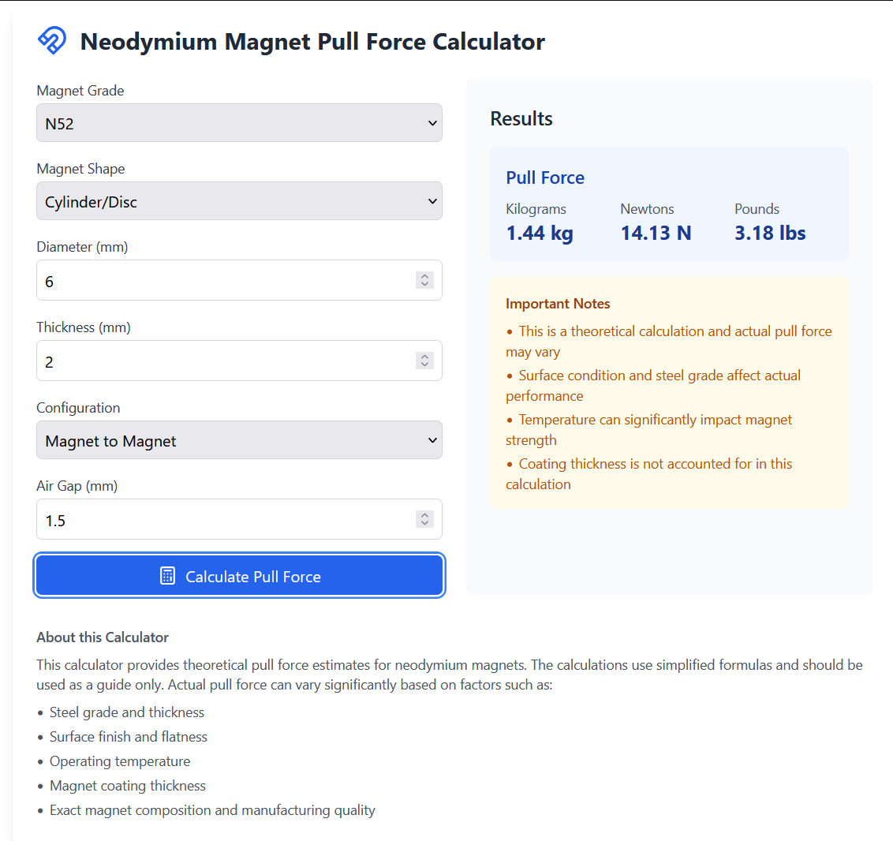

# MagForce - Neodymium Magnet Pull Force Calculator

A React-based web application for calculating the theoretical pull force of neodymium magnets based on grade, size, and configuration.



## Features

- Support for multiple neodymium grades (N35-N52)
- Cylinder/disc and block magnet shapes
- Magnet-to-steel and magnet-to-magnet configurations
- Air gap calculations
- Results in kg, N, and lbs
- Responsive design

## Getting Started

### Prerequisites

- Node.js (v14 or higher)
- npm or yarn

### Installation

1. Clone the repository:
   ```bash
   git clone https://github.com/Soygen/magforce.git
   cd magforce
2. npm install
3. npm start
4. Open http://localhost:3000

### Static Deployment

1. npm run build 
(The build folder will contain static files ready for deployment.)

